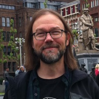

Dan contributes to the development and maintenance of Monarch applications, tools and and supporting infrastructure. He supports the building of ontologies and tools to provide interrogation and reasoning. He integrates ontologies and data for evaluation, inference and presentation.

### Education

- BS, Northwestern University, Evanston, IL, 1987
- MS, University of Oregon, Eugene, OR, 2008
- PhD, University of Oregon, Eugene, 2012

My picture:

### Interests

blah blah blah
